# AASClient

## Aufbau
Folgende Ordnerstrutkur wurde für das Projekt gewählt:

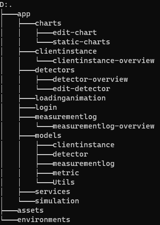

### Components
Wie im obigen Screenshot ersichtlich, gliedert sich der Hauptordner app in einzelene Component-Gruppen mit entweder einer oder 2 Components. Beinhaltet eine Component-Group zwei Components so sind diese in eine `Overview` und eine `Edit` Component gegliedert.

### Models
Da wir ja mit DTOs arbeiten, beinhaltet der Ordner `models` alle benötigten DTOs für eine Entität. Zusätzlich wurde noch ein Ordner mit `Util` Entitäten erstellt um das dynamische erstellen von Charts und das anzeigen von zusätzlichen Information zu ermöglichen.

## Design

Für das Design wurde `Bootstrap`, `Ng-Bootstrap` und `Angular Material` herangezogen.

## Components
### Login
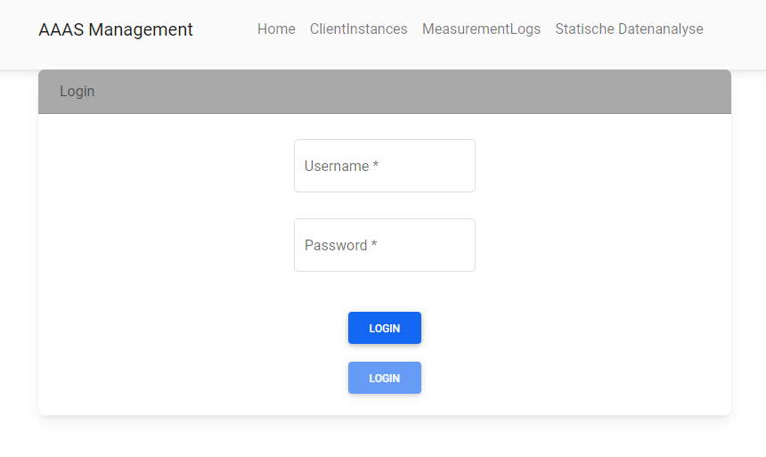

Der Login wird immer dann angezeigt wenn der User nicht angemeldet ist. Der obere Button ist dabei für den Login mit Keycloak verantwortlich (leitet auf den unteren Screenshot weiter). Der untere Button ist nur verfügbar wenn ein Username und ein Passwort vom User eingegebenw worden sind.

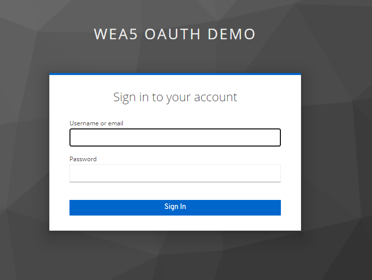

### ClientInstances
Nach der erfolgreichen Authentifizierung wird man auf die `clientinstances` weitergeleitet.
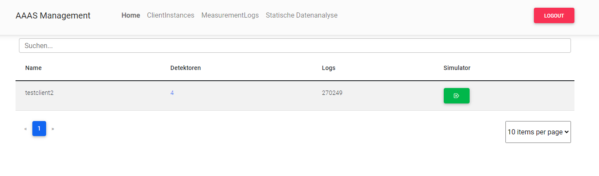

In dieser Component wird ein Überblick über alle ClientInstances auf die der User Zugriff hat bereitgestellt. Dabei wird die Anzahl der Detektoren und Logs dargestellt. Zudem besteht die Möglichkeit eine Simulation der ClientInstance zu starten.

### Simulation
Nach Drücken des Simulatorbuttons in der `ClientInstance Component` wird man auf folgende Seite weitergeleitet
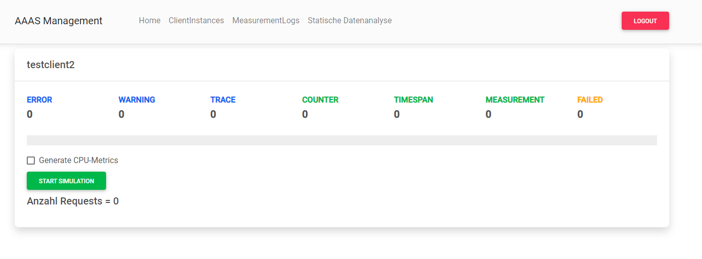

Im Simulator hat man die Möglichkeit entweder Random Logs und Metriken, oder spezifische Metriken für die CPU-Metrik zu simulieren. 

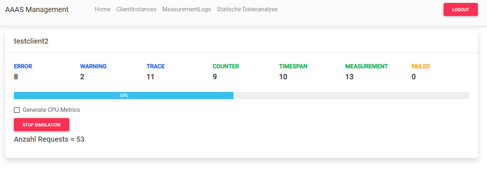

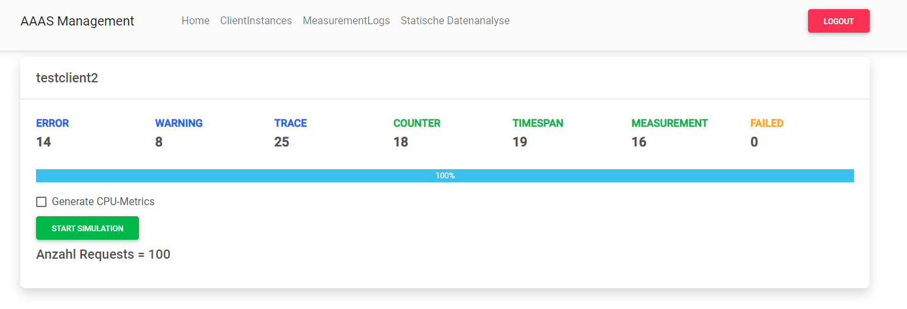

Während der Simulation werden 100 Nachrichten im Abstand von jeweils 100ms an den Server gesendet, die Ergebnisse der Requests werden dann mit einem Counter dargestellt. Man kann die Simulation beliebig stoppen und neu starten.

### Detektoren
In der `DetectorOverviewComponent` hat der User die Möglichkeit sich alle Detektoren anzusehen und diese zu bearbeiten oder hinzuzufügen.
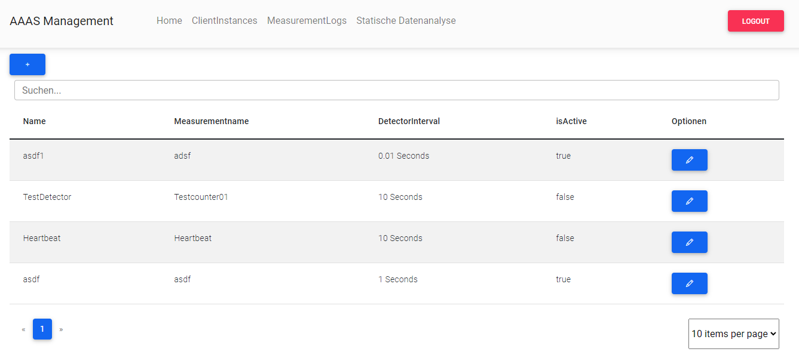

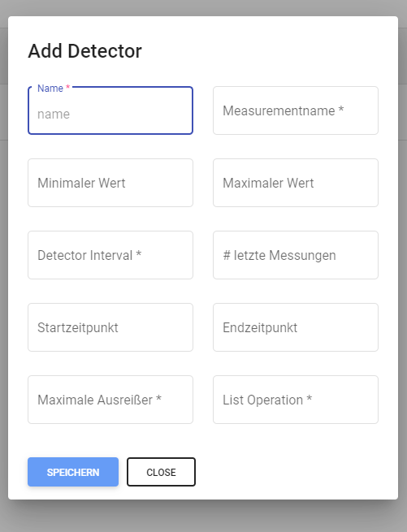

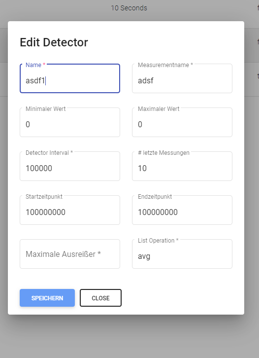

### Loading Animation
Beim Laden von Daten wird folgende Ladeanimation angezeigt um dem User zu signalisieren, dass die Daten noch geladen werden.

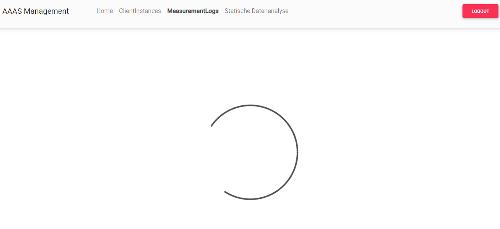

### MeasurementLogs
Hier werden allgemeine Informationen über Logs dargestellt, diese können über die Properties gefiltert werden, außerdem besteht die Möglichkeit einer Pagination welche entweder 5, 10 oder 20 Items anzeigt. Das CreatedAt Field wird dabei mit einer `Pipe` von Ticks zu einem Datum umgerechnet.

Overview
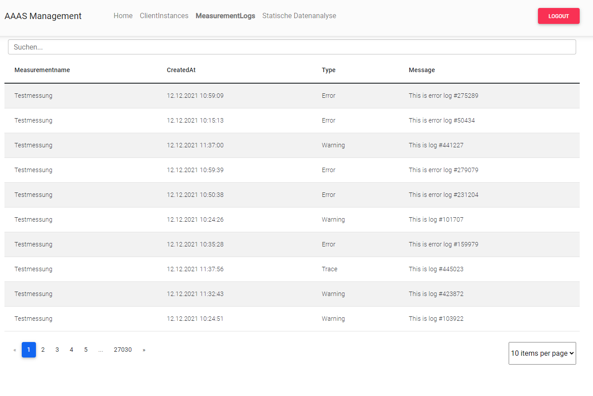

Suche
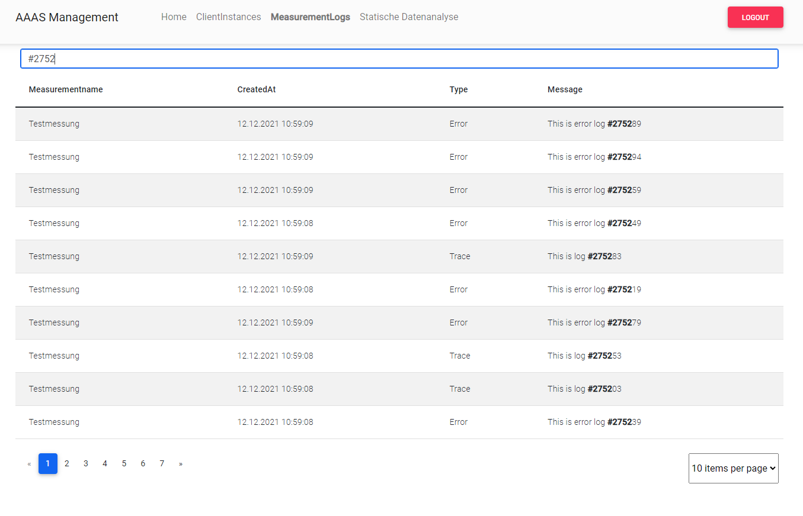

Pagination
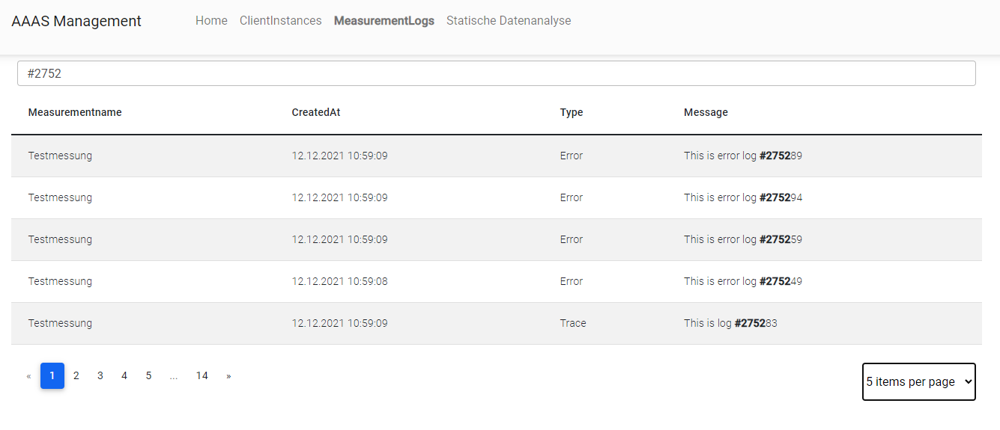


### Datenanalyse

Statisches Chart welches die CPU-Temperatur anzeigt
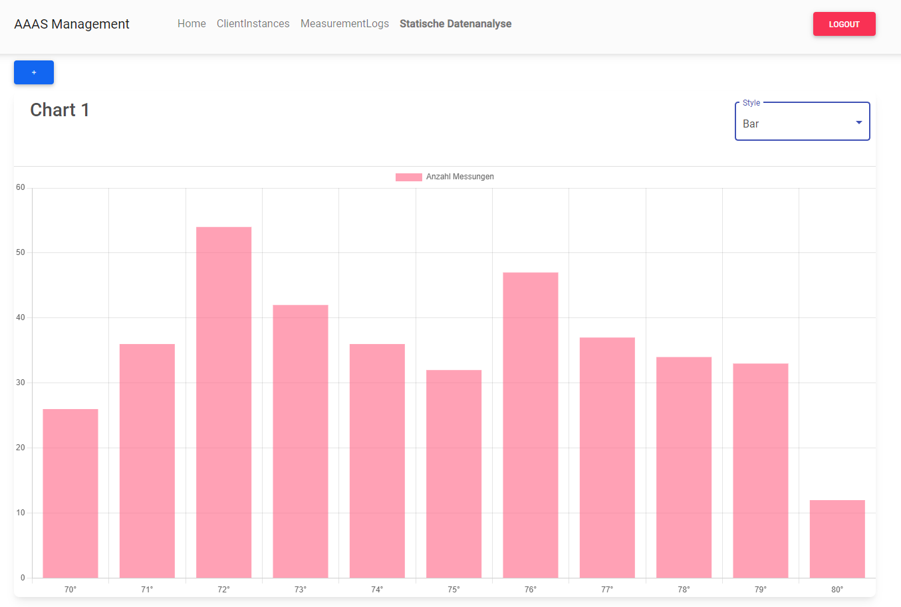

Hier wird ein neues dynamisches Chart erstellt
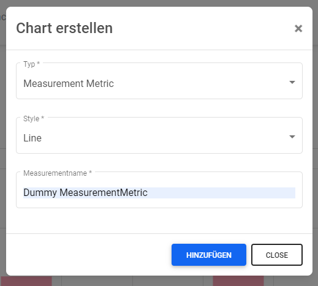

Das Ergebnis aus dem vorherigen Dialog
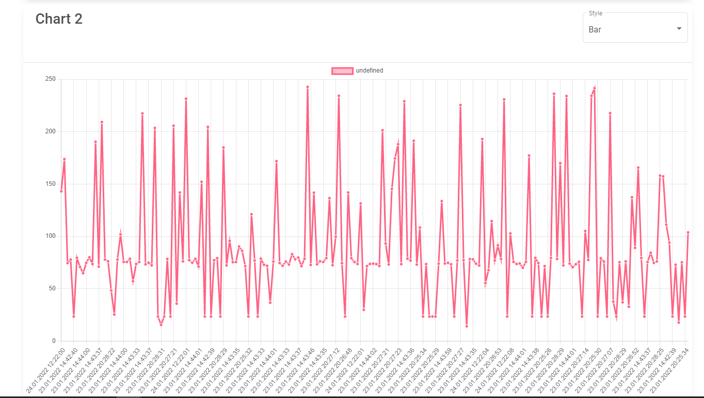

Der Styles jedes Charts kann jederzeit umgeändert werden
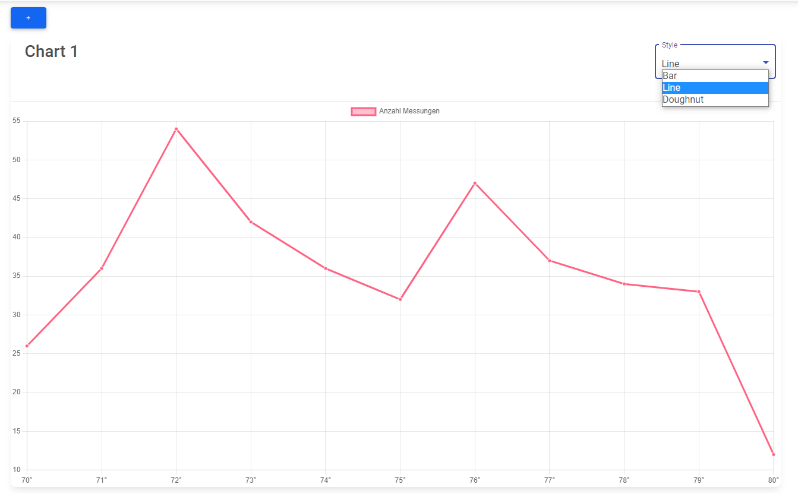

## OAuth
Für die Authentifizierung wurde der Kecloak Server aus der Übung verwendet. Leider war es aber nicht möglich den Code der Übung einfach zu duplizieren, hier mein Code der sich von der Übung unterscheidet:

```c#
private configureWithNewConfigApi() {
    this.oauthService.configure(authConfig);
    this.oauthService.loadDiscoveryDocumentAndTryLogin();
    //--- tryLogin wird zusätzlich gebraucht um sich beim Server anmelden zu können - obiger Code hat in der Übung jedoch funktioniert, Konfigurationsfehler OAuth
    this.oauthService.tryLogin();
  }
```

## Services
### API-URL
Um die API-URL einheitlich den Services zur Verfügung zu stellen, wurde im Environment die baseUrl der API definiert:

```typescript
export const environment = {
  production: false,
  baseUrl: "http://localhost:5265/api"
};
```

### Setup
Bevor man mit dem Service Calls absetzen kann wird im Service die baseUrl mit der spezifischen Route festgelegt.

```typescript
private apiUrl: string = "";

  constructor(private http: HttpClient) {
    this.setup();
  }

  private setup(){
    this.apiUrl = `${environment.baseUrl}/Management`;
  }
```

### Requests
Get Requests werden folgendermaßen aufgebaut:

```typescript
getMeasurementLogsByClientInstanceId(clientInstanceId: string): Observable<Array<MeasurementlogDto>> {
    let params = new HttpParams();

    if(clientInstanceId !== null){
      params = params.append("clientInstanceId", clientInstanceId);
    }

    return this.http.get<Array<MeasurementlogDto>>(this.apiUrl + "/MeasurementLog", {
      params: params
    });
  }
```

PUT und POST Requests werden folgendermaßen aufgebaut:
```typescript
createDetector(detector: DetectorCreationDto): Observable<string>{
    return this.http.post<string>(this.apiUrl + "/Detector", detector);
  }
  
  updateDetector(detector: DetectorUpdateDto): Observable<boolean>{
    return this.http.put<boolean>(this.apiUrl + "/Detector/" + detector.id, detector);
  }
```

## Pipes
### TicksToDatePipe
Datumswerte kommen von der Datenbank als Ticks zurück, diese müssen dann in ein Datum umgerechnet werden
```typescript
export class TicksToDatePipe implements PipeTransform{
    transform(value: number): string {
        //luckily stackoverflow exists
        //https://stackoverflow.com/questions/15486299/convert-c-sharp-net-datetime-ticks-to-days-hours-mins-in-javascript
        let time = value; // Time value in ticks
        let days = Math.round(time/(24*60*60*10000000)); // Math.floor() rounds a number downwards to the nearest whole integer, which in this case is the value representing the day
        let hours = Math.floor((time/(60*60*10000000)) % 24); // Math.round() rounds the number up or down
        let mins = Math.floor((time/(60*10000000)) % 60);
        let sec = Math.floor((time/10000000) % 60);

        let date: Date = new Date("0001-01-01T00:00:00");
        date.setDate(days);
        date.setHours(hours);
        date.setMinutes(mins);
        date.setSeconds(sec);

        return formatDate(date, "dd.MM.YYYY HH:mm:ss", "en-US");
    }
}
```
### TicksToSecondsPipe
Datumswerte kommen von der Datenbank als Ticks zurück, diese müssen dann in Sekunden umgerechnet werden

```typescript
export class TicksToSecondsPipe implements PipeTransform{
    transform(value: number): string {
        return value / Math.pow(10, 7) + " Seconds";
    }
}
```